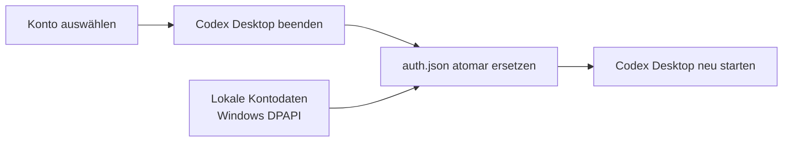

# Codex Simple Accounts

[](https://github.com/Momik-jpg/Codex-Simple-Accounts/actions/workflows/ci.yml) [](LICENSE)

Eine lokale Windows-App für Codex-Konten, Limits und neue Aufgaben mit geprüfter Modellwahl.

## Funktionen

- Beliebig viele Konten hinzufügen und lokal verwalten
- Konto- und Wochenlimits regelmässig anzeigen
- Automatischer Kontowechsel bei tiefem Restlimit
- Die zu Codex gehörenden Desktop-Prozesse beim Kontowechsel beenden und mit dem gewählten Konto neu starten
- Kontonamen aus der lokalen Anmeldung anzeigen
- Kontodaten mit Windows-DPAPI verschlüsseln
- Notfall-Schalter zum Abbrechen eines Wechsels und Ausschalten von Auto-Swap
- Aufgabenrouter mit automatischer oder manueller Qualitäts-, Modell- und Denkstufenwahl aus dem Live-Modellkatalog
- Lokale Sicherheitsuntergrenzen, sichtbare Fallbacks und erneute Katalog-/Regelprüfung unmittelbar vor dem Start
- Wiederverwendbare Einstufung für einen schnelleren Start ohne doppelten Klassifikationsaufruf
- Vorschau eines auftragsbezogenen KI-Arbeitsplans mit Prüfschritten und ungeprüften Abschlusskriterien; nach Projektinspektion zu bestätigen
- Direkter Aufgabenrouter-Einstieg im Tray-Menü mit klaren Lauf-, Abbruch-, Eingabe- und Kontowechselstatus

## Sicherer Wechselablauf

Die App hält Kontodaten lokal verschlüsselt und führt den Wechsel in einem klaren Ablauf aus.



## Installation

1. Unter [Releases](https://github.com/Momik-jpg/Codex-Simple-Accounts/releases) den neusten `Codex-Konten-Installer.exe` herunterladen.
2. Installer ausführen.
3. `Codex-Konten` öffnen und Konten hinzufügen.

Die Kontoverwaltung benötigt Windows 10 oder 11 und die installierte Codex-Desktop-App. Für neue Auto-Aufgaben sind zusätzlich Python 3.10+ und eine angemeldete aktuelle Codex-CLI erforderlich. Der Router kann Konto-Kontingent verbrauchen; eine Einstufung ist kein kostenloser Offline-Vorgang. Details: [Auto-Aufgabe](docs/AUTO_TASK_ROUTER.md).

## Sicherheit

- Kontodaten bleiben lokal und werden mit Windows-DPAPI für den aktuellen Benutzer verschlüsselt.
- Die App startet keinen dauerhaften WebSocket-Proxy und keinen Listener auf Port `47831`; die bestehende Codex-Protokollprüfung kann kurzzeitig einen freien lokalen Port verwenden.
- Beim Wechsel wird `~/.codex/auth.json` atomar durch die ausgewählte lokale Anmeldung ersetzt.
- Bei fehlgeschlagenem Start wird die vorherige Anmeldung wiederhergestellt; ein Wechsel wartet, bis Codex Desktop geschlossen ist.
- Der Aufgabenrouter startet standardmässig ohne Schreibrecht, sperrt parallele Kontoaktionen und protokolliert keine Authentifizierungsdateien.
- Der Quellcode enthält keine Kontodaten oder Zugangsschlüssel.

Vor der Installation eines Releases kann die SHA-256-Prüfsumme in den Release Notes verglichen werden.

## Selber bauen

Voraussetzungen:

- .NET 9 SDK
- Inno Setup 6

```powershell
.\build.ps1
```

Der Installer wird unter `artifacts/installer/Codex-Konten-Installer.exe` erstellt.
Ein erfolgreicher Build ersetzt keine Clean-Install-, Upgrade- oder Kontoabnahme.

## Tests

```powershell
dotnet test .\CodexAccountTray.sln -c Release
python -m unittest discover -s tools/task-router/tests -v
python tools/verify_metadata.py
```

## Hinweis

Dieses Projekt ist ein unabhängiges Hilfsprogramm und nicht mit OpenAI verbunden oder von OpenAI unterstützt.


## Lizenz

MIT – siehe [LICENSE](LICENSE).
